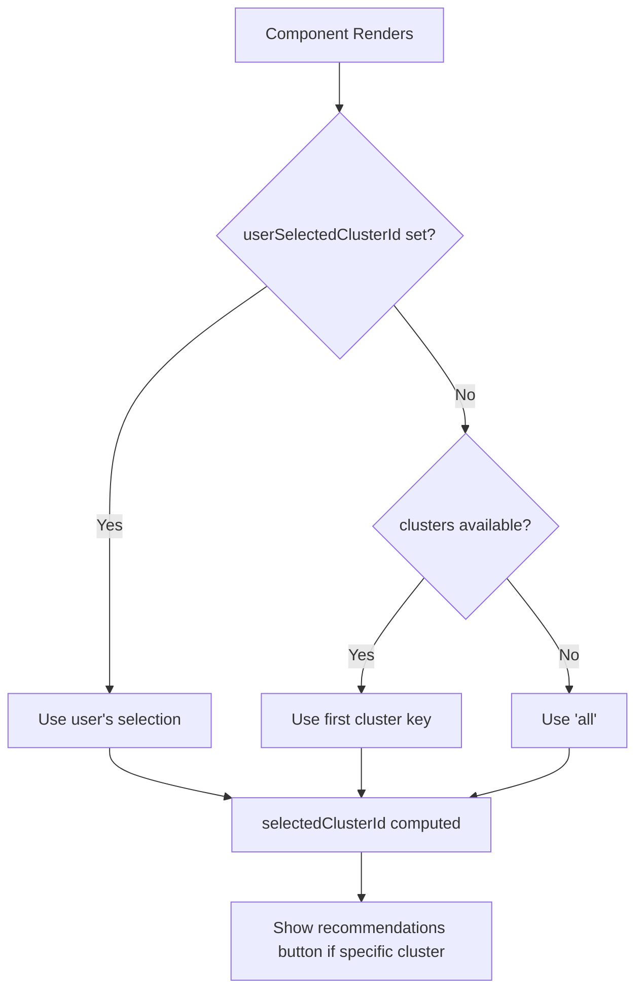

# ECOPROJECT-3871 | fix: Default report view to first cluster

## Issue Summary

**Bug**: [UI] Assessment report default view should show the first cluster instead of "all clusters"

**Problem**: Currently, the default report view displays "All clusters", but "Target cluster recommendations" are only shown when a specific cluster is selected. Users must manually change the dropdown selection to see recommendations.

**Expected Behavior**: The default view should automatically select the first cluster, making "Target cluster recommendations" visible by default.

## Root Cause Analysis

In [src/pages/report/Report.tsx](src/pages/report/Report.tsx):

```typescript
const [selectedClusterId, setSelectedClusterId] = useState<string>("all");
```

The cluster selection was hardcoded to `"all"` on initial render. The "View target cluster recommendations" button is conditionally rendered only when `selectedClusterId !== "all"`.

## Solution (Implemented)

Used a derived state pattern with `useMemo` to compute the effective cluster selection. This approach:

- Tracks user's explicit selection separately from the default
- Auto-selects the first cluster when clusters are available
- Preserves user ability to choose "All clusters" from dropdown
- Avoids lint warnings about setState in useEffect



## Implementation Details

### Changes to Report.tsx

**File**: [src/pages/report/Report.tsx](src/pages/report/Report.tsx)

1. Updated imports to include `useMemo`:

```typescript
import React, { useMemo, useState } from "react";
```

1. Changed state from `selectedClusterId` to `userSelectedClusterId` (tracks explicit user selection):

```typescript
// Track user's explicit selection; null means "use default (first cluster)"
const [userSelectedClusterId, setUserSelectedClusterId] = useState<
  string | null
>(null);
```

1. Added computed selection using `useMemo`:

```typescript
// Compute effective selection: user's choice takes precedence, otherwise first cluster
const selectedClusterId = useMemo(() => {
  if (userSelectedClusterId !== null) {
    return userSelectedClusterId;
  }
  const clusterKeys = assessmentClusters ? Object.keys(assessmentClusters) : [];
  return clusterKeys.length > 0 ? clusterKeys[0] : "all";
}, [userSelectedClusterId, assessmentClusters]);
```

1. Updated `handleClusterSelect` to use the new setter:

```typescript
if (typeof value === "string") {
  setUserSelectedClusterId(value);
}
```

### Tests Added

**File**: [src/pages/report/Report.test.tsx](src/pages/report/Report.test.tsx)

- Added test: "auto-selects first cluster on initial load to show recommendations button"
- Added test: "shows disabled recommendations button when cluster has no VMs"

**File**: [src/pages/report/assessment-report/clusterView.test.ts](src/pages/report/assessment-report/clusterView.test.ts)

- Added test: "returns cluster options with 'All clusters' first followed by cluster keys"

## Validation

- Lint checks pass
- Format checks pass
- TypeScript type checks pass
- All tests pass (70 tests)
- Security vulnerability scan passes

## Edge Cases Handled

1. **No clusters**: If `clusters` is undefined or empty, the selection defaults to "all"
2. **Single cluster**: Works correctly - that cluster becomes the default
3. **User changes selection**: User's explicit selection takes precedence over default
4. **Page refresh**: Auto-selects first cluster again (expected behavior)

## Related Issues

- [ECOPROJECT-3905](https://issues.redhat.com/browse/ECOPROJECT-3905): Backend task to reorder cluster list by cluster size (number of VMs) - this UI change will naturally benefit from that ordering once implemented
