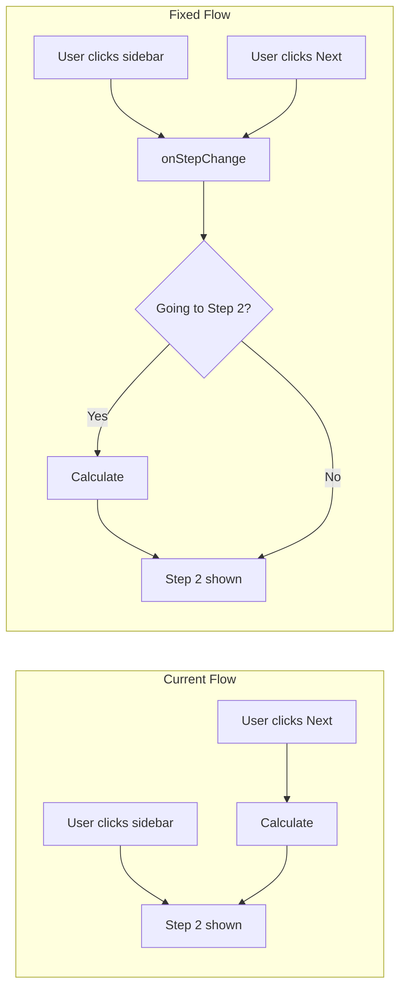

# ECOPROJECT-3879 | fix: Trigger calculation on sidebar navigation

## Problem

In the "Target cluster recommendations" wizard, navigating from Step 1 to Step 2 via sidebar clicks bypasses the calculation API call, showing stale/missing data.

## Root Cause

The calculation logic is only wired to the "Next" button handler in [SizingInputFormWizardStepFooter.tsx](src/pages/report/cluster-sizer/SizingInputFormWizardStepFooter.tsx):

```typescript
const handleNext = (): void => {
  void onCalculate().then(() => {
    void goToNextStep();
  });
};
```

PatternFly's `Wizard` allows sidebar navigation by default, which bypasses this custom handler.

## Solution

Use the Wizard's `onStepChange` callback to intercept **all** navigation events (both sidebar clicks and button clicks) and trigger calculation when moving to the review step.



## Implementation

### 1. Modify ClusterSizingWizard.tsx

Add `onStepChange` callback to the `Wizard` component that triggers calculation when navigating **to** the review step:

```typescript
const handleStepChange = useCallback(
  async (
    _event: React.MouseEvent<HTMLButtonElement>,
    currentStep: WizardStepType,
    _prevStep: WizardStepType,
  ): Promise<void> => {
    // Trigger calculation when entering the review step
    if (currentStep.id === "review-step") {
      await handleCalculate();
    }
  },
  [handleCalculate],
);
```

Then add to the Wizard:

```tsx
<Wizard
  height={700}
  onClose={handleClose}
  onStepChange={handleStepChange}
  // ...
>
```

### 2. Simplify SizingInputFormWizardStepFooter.tsx

Remove the calculation logic from the footer since it's now centralized in `onStepChange`:

```typescript
const handleNext = (): void => {
  void goToNextStep();
};
```

### 3. Add/Update Tests

Create test for [ClusterSizingWizard.test.tsx](src/pages/report/cluster-sizer/ClusterSizingWizard.test.tsx):

- Test that calculation is triggered when navigating via sidebar
- Test that calculation is triggered when clicking "Next" button
- Test that going back to Step 1 does not trigger calculation

## Files to Change

| File                                                                                                      | Change                                                                 |
| --------------------------------------------------------------------------------------------------------- | ---------------------------------------------------------------------- |
| [ClusterSizingWizard.tsx](src/pages/report/cluster-sizer/ClusterSizingWizard.tsx)                         | Add `onStepChange` handler, import `WizardStepType`                    |
| [SizingInputFormWizardStepFooter.tsx](src/pages/report/cluster-sizer/SizingInputFormWizardStepFooter.tsx) | Remove `onCalculate` prop and logic, simplify to just `goToNextStep()` |
| [ClusterSizingWizard.test.tsx](src/pages/report/cluster-sizer/ClusterSizingWizard.test.tsx)               | Add tests for sidebar navigation triggering calculation                |
